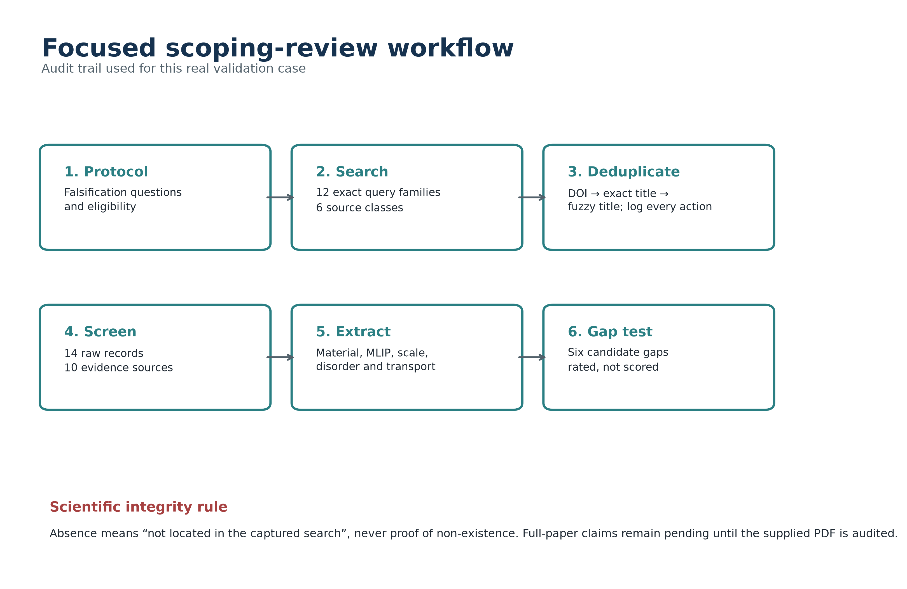
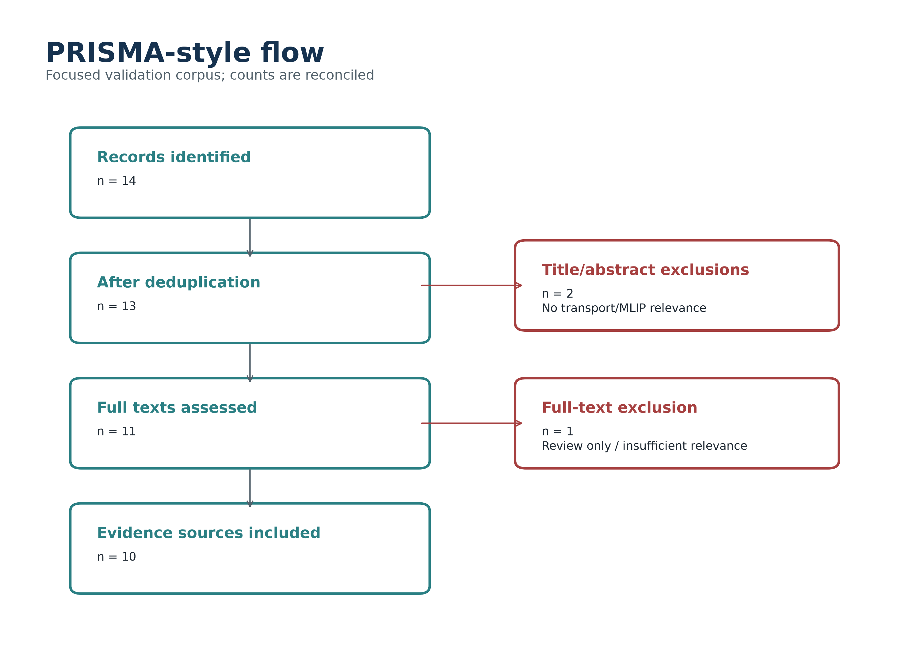
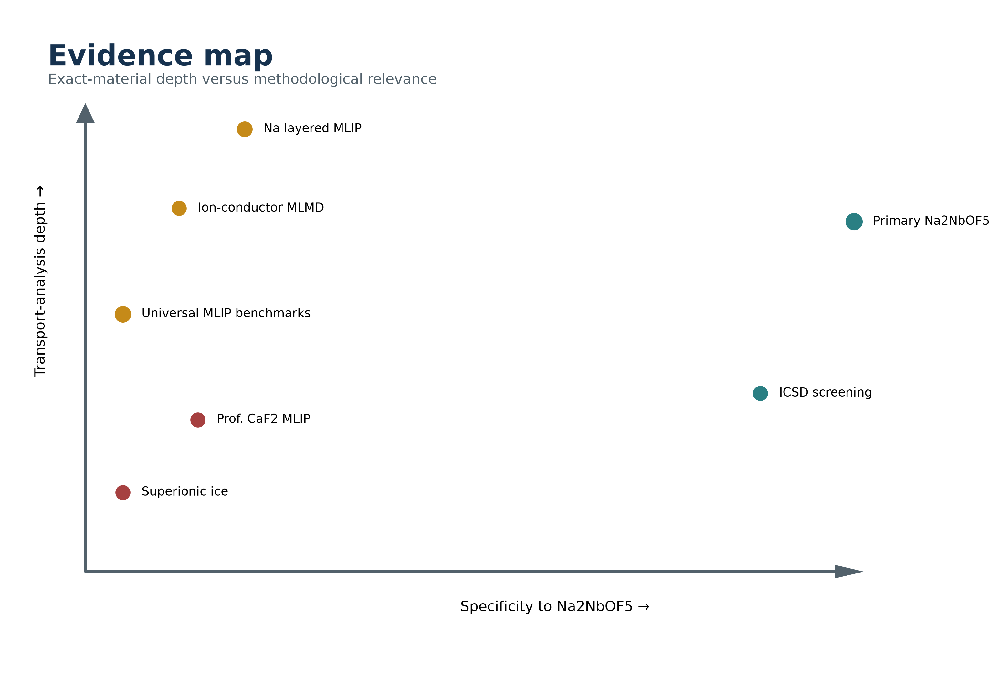
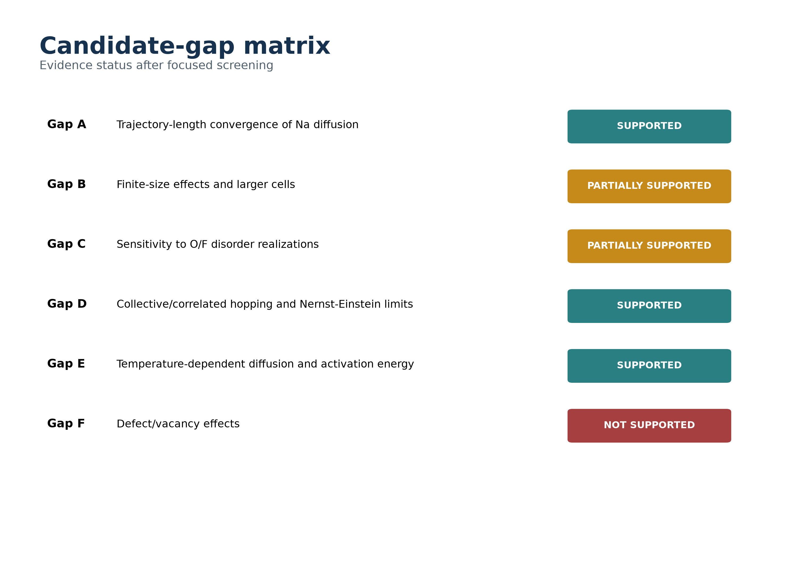
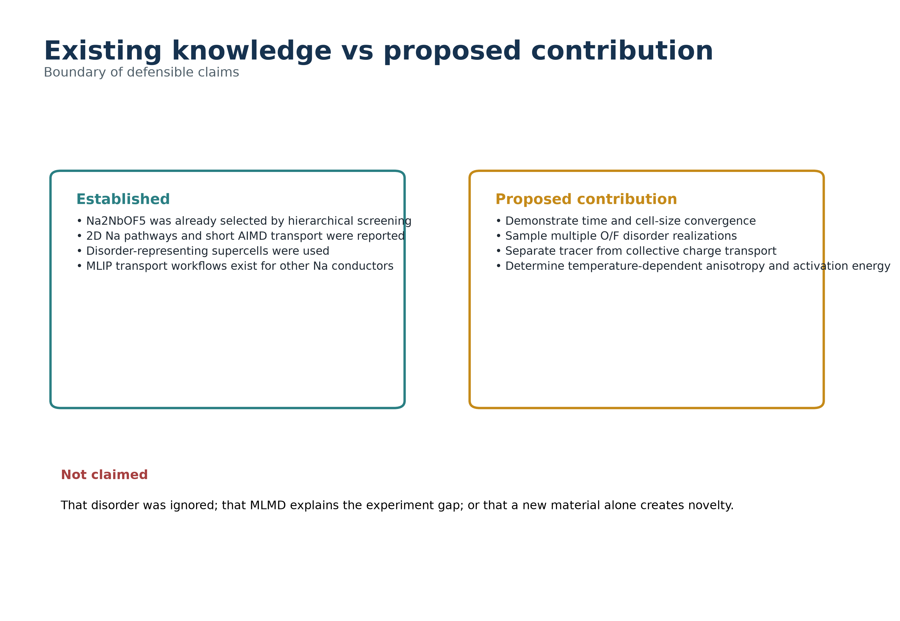
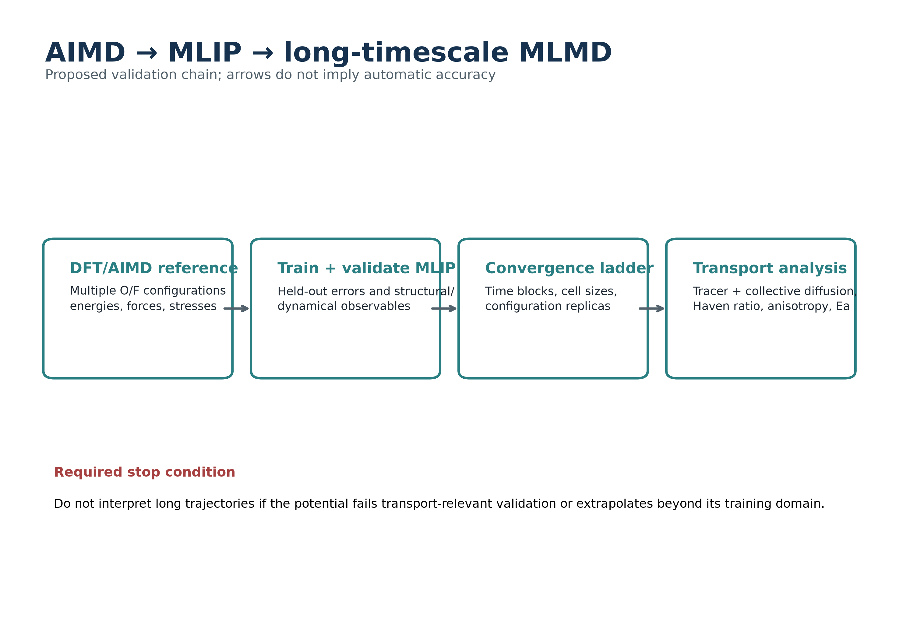

# SciReview Chem — Real-World Validation Case Study

## From literature search to research-gap identification for MLIP simulation of Na2NbOF5

### Case purpose

This case tested whether SciReview Chem could support a real, adversarial proposal screen rather than produce a synthetic portfolio artifact. The target was a graduate proposal on long-timescale Na transport in disordered Na2NbOF5. The review attempted to falsify novelty across exact-material literature, contextual MLIP transport work and the prospective supervisor's public research.

### Protocol and search

Twelve documented query families were run across six source classes. Fourteen unique audit records were assembled; one preprint/journal duplicate was logged, two records were excluded at title/abstract, eleven were assessed for evidence relevance, one generic review was excluded at full text and ten sources were retained. Because the search interface did not expose reproducible database-total counts, the log reports captured and screened counts rather than invented global hit counts.

### Evidence result

The exact-material literature located comprises a hierarchical screening study and the subsequent AIMD/electrochemical paper. The public record did not reveal a dedicated Na2NbOF5 MLIP, long-time convergence analysis, explicit Haven/collective treatment, or classical potential. Contextual studies show that MLMD, correlation analysis and universal MLIP screening are established methods. Therefore the method is not the contribution; the Na2NbOF5-specific convergence and correlation question may be.

### Primary-paper integrity boundary

The user specified exact AIMD and experimental details, but no PDF was present. SciReview Chem therefore records those data as user-provided notes pending source verification. The audit never claims that the paper ignored disorder and never treats the unsintered, impure pellet conductivity as intrinsic bulk validation.

### Gap test

Three candidate gaps were supported, two partly supported, and one not supported. The surviving question integrates trajectory/cell/configuration convergence with collective transport. Defects/vacancies were rejected as a primary gap because the accessible evidence does not yet justify a distinct, bounded claim.

### Supervisor overlap

Public records show Prof. Matusalém using ML potentials for superionic CaF2/related fluorides and water ice. This is adjacent methodological overlap, not the same material/problem. Direct overlap was not located; unpublished overlap remains a question for the supervisor.

### App validation findings

The real case revealed that SciReview Chem's search log lacked screened/retained fields, title-stage exclusions did not require a reason, and extraction templates omitted MLIP transport variables. The application was updated to capture those counts, require exclusion reasons, and add an MLIP ion-transport template covering training data, simulation scale, disorder, tracer/collective diffusion, conductivity, Haven ratio and activation energy. Regression tests were added.

### Limitations

This is a focused scoping review based on captured web/publisher records, not an exhaustive subscription-database search. Total hit counts were unavailable, the full primary paper was not supplied, and public sources cannot exclude unpublished competing work. These limitations narrow the claims rather than being filled with inference.

### Final concept

The defensible project is a validated MLMD convergence and transport-correlation study, not a generic application of MLIP to a new material. The workflow is AIMD reference → validated potential → convergence ladder → tracer and collective transport analysis.

### Source registry
- [Morkhova et al. (2026), A new sodium-ion conductor Na2NbOF5](https://doi.org/10.1016/j.jpcs.2026.113889)
- [Morkhova et al., SSRN preprint record](https://doi.org/10.2139/ssrn.6481875)
- [Hierarchical screening of ICSD ... mixed polyanionic oxohalides](https://doi.org/10.1007/s10008-025-06205-4)
- [Na2NbOF5:Mn4+ phosphor record](https://pubmed.ncbi.nlm.nih.gov/34576541/)
- [He, Chen & Lai, Na diffusion with MLIPs](https://doi.org/10.2139/ssrn.4431516)
- [Miyagawa et al., MLMD ion migration](https://arxiv.org/abs/2401.11244)
- [Aghoghovbia et al., Probing MLIPs on ion transport](https://doi.org/10.1002/aidi.70143)
- [ML-assisted discovery of sodium superionic conductors](https://doi.org/10.1039/D5MH01176K)
- [Neural-network potential for solid-state electrolyte diffusion](https://arxiv.org/abs/1910.10090)
- [Constructing MLIPs with minimum ab initio data](https://www.nature.com/articles/s41524-026-02023-y)
- [Benchmarking universal MLIPs for alkali-ion battery kinetics](https://doi.org/10.1021/acsmaterialslett.6c00134)
- [ITA research-area description](https://www.pgfis.ita.br/en/post/fisica-atomica-e-molecular)
- [EFITA 2025 proceedings: neural-network potential for CaF2](https://www.efita.ita.br/wp-content/uploads/2025/07/2025-07-31-Anais_do_XVIII_EFITA.pdf)
- [ITA PIBIC 2025 result: superionic fluorides ML project](https://paic.ita.br/documentos/editais/PIBIC-2025-Resultado.pdf)
- [Deep-Potential dataset for superionic water ice](https://doi.org/10.5281/zenodo.6518808)
- [Russian Science Foundation project 23-73-01067](https://rscf.ru/project/23-73-01067/)
